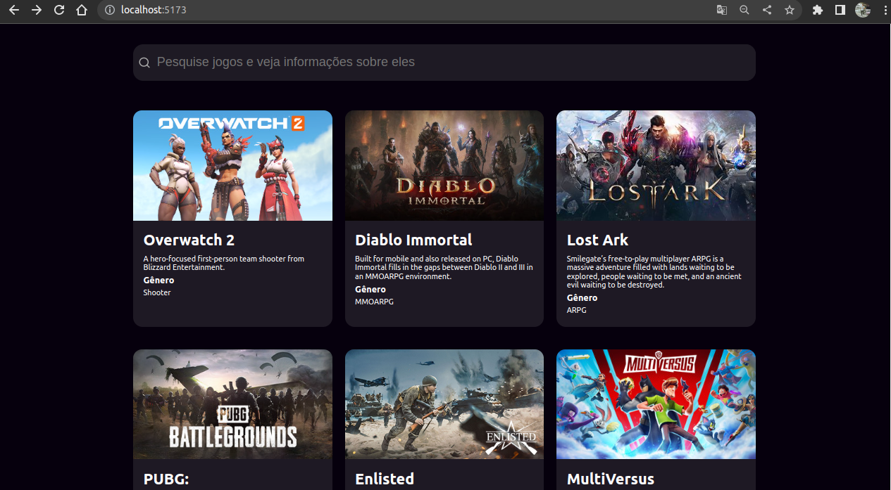

# Game Card

# Autor

Jonas Miranda

## Como utilizar

Para iniciar o projeto, deverá ser executado:

### `npm install`

### `npm run dev`

Inicia o app em modo desenvolvedor

## Projeto

           

Foram realizadas as seguintes implementações:

- Tela de listagem para cards
- Barra de pesquisa com filtro dinâmico enquanto digita
- Componente de Loading enquanto a requisição é feita
- Busca dos perfis pela API: https://games-test-api-81e9fb0d564a.herokuapp.com/api/
- Tratativa de erros retornadas a partid de status code
- Navegação via rotas utilizando react router dom
- Responsividade para tablets e celulares
- Chamadas de query utilizando React query e axios

### Referências

API: https://games-test-api-81e9fb0d564a.herokuapp.com/api/

React Query : https://tanstack.com/query/v3/

Axios: https://axios-http.com/ptbr/docs/intro

Documentação React: https://react.dev/

React icons: https://www.npmjs.com/package/react-icons

React router dom: https://www.npmjs.com/package/react-router-dom
